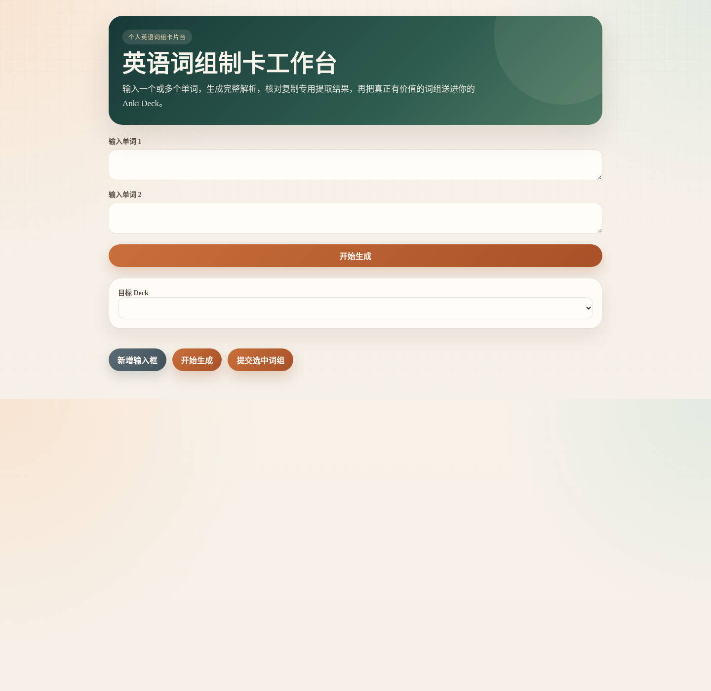

# EnglishLearning

[English README](README.md)

一个把 Gemini 生成的英语词组解析人工筛选后再提交到 Anki 的本地工作台。

EnglishLearning 是一个本地制卡工作台，用来生成、审核、编辑并提交真正有价值的词组卡片，同时保留完整 AI 上下文方便人工判断。

## GitHub 仓库速览

- 这是个人工具，不是公共 SaaS 产品
- 仓库内自带的 prompt 文件是必需文件，不是可选示例
- 可以对一个或多个输入词调用 Gemini 生成词组解析
- 页面保留完整 AI 输出，方便人工筛选真正值得入卡的内容
- 支持编辑提取出的 `Front` / `Back`，处理重复 `Front`，只提交你确认过的卡片

仓库短描述建议：

```text
Personal English phrase card workspace with Gemini generation, manual review, and Anki submission.
```

## 文档导航

- 英文文档入口：[`docs/README.md`](docs/README.md)
- 中文文档入口：[`docs/README.zh-CN.md`](docs/README.zh-CN.md)
- 英文场景索引：[`docs/scenario/README.md`](docs/scenario/README.md)
- 中文场景索引：[`docs/scenario/README.zh-CN.md`](docs/scenario/README.zh-CN.md)
- 英文贡献说明：[`CONTRIBUTING.md`](CONTRIBUTING.md)
- 中文贡献说明：[`CONTRIBUTING.zh-CN.md`](CONTRIBUTING.zh-CN.md)

## 3 分钟快速开始

1. 安装 `Python 3.12+` 和 `uv`。
2. 克隆仓库并执行 `uv sync`。
3. 把 Gemini key 放进 `key`，或者设置 `GEMINI_API_KEY`。
4. 确保 `英语二的备考prompt.txt` 在项目根目录。
5. 如果要提交到 Anki，先打开装有 AnkiConnect 的 Anki。
6. 如果你本地的 AnkiConnect 使用了自定义地址或端口，把对应 JSON 配置放到项目根目录 `AnkiConnect`，或者直接设置 `COPY_FORMAT_ANKI_CONNECT_URL`。
7. 启动应用：

```bash
uv run python -m src.web_entrypoint
```

8. 打开：

```text
http://127.0.0.1:8031
```

如果你只想先看最重要的配置入口，可以直接跳到 [`去哪里改 URL 和 API Key`](#去哪里改-url-和-api-key)。

如果你机器上的 `uv` 还跑不起来，先看 [`按操作系统安装 Python 和 uv`](#按操作系统安装-python-和-uv)。

## 快速了解

- 支持多个输入块，适合批量生成
- 大批量审核时有置顶概览条，方便持续查看进度
- 页面保留完整 AI 响应，方便人工审核
- 提取出的词组对可继续编辑
- 最终提交结果使用卡片式预览
- 重复 `Front` 支持手动锁定优先保留
- 提交后会更清楚地区分已加入、已跳过和失败项
- 通过 AnkiConnect 选择本地 deck 并提交

## 页面截图



## 这个项目能做什么

- 为一个或多个输入单词生成完整 AI 解析
- 从特殊复制格式中提取词组对
- 在提交前编辑、勾选、取消勾选，并锁定重复的 `Front`
- 在批量审核时持续显示审核概览
- 用卡片式预览展示最终会提交到 Anki 的结果
- 提交后会按已加入、已跳过、提交失败分组展示反馈
- 通过 AnkiConnect 把选中的词组对提交到 Anki

## 使用流程

1. 在本地网页中输入一个或多个英文单词。
2. 点击生成按钮，请求 AI 输出。
3. 查看完整响应和提取出的词组对。
4. 按需修改 `Front` 和 `Back`。
5. 可取消勾选低价值词组；如果有重复 `Front`，也可以锁定你想保留的那一条。
6. 查看最终提交卡片预览。
7. 选择目标 deck，并提交到 Anki。
8. 查看按结果分组的提交反馈。

## 使用示例

输入词：

```text
take
bring
```

页面会让你审核这些内容：

- 每个输入词对应的完整 Gemini 响应
- 从复制专用格式中提取出的词组对
- 每条是否提交的勾选框
- 当出现重复 `Front` 时用于指定保留项的锁定控件
- 批量审核时始终可见的概览区
- 最终会发送到 Anki 的卡片式预览
- 按已加入、已跳过、失败分类的提交反馈

这样既能保留 AI 原始解析，也能在提交前人工收口出更干净的学习卡片。

## 界面重点

虽然这次还没有附上仓库内截图，但当前审核页的结构已经比较清晰，核心区域包括：

- 一个或多个输入词块
- 适合批量审核的置顶概览区
- 每个词对应的完整 Gemini 响应
- 可编辑的 `Front` / `Back` 词组对
- 用于勾选和锁定重复项的控制区
- 提交到 Anki 之前的卡片式预览区
- 提交后更清晰的结果反馈卡片

这样既保留了 AI 原始上下文，也让最终提交集合更容易人工确认。

## Roadmap

- GitHub 规划 issue: [#1 Track next workflow improvements](https://github.com/Amo-zwk/EnglishLearning/issues/1)
- 已完成: [#2 Improve review layout for larger batches](https://github.com/Amo-zwk/EnglishLearning/issues/2)
- 已完成: [#4 Add clearer Anki submission feedback](https://github.com/Amo-zwk/EnglishLearning/issues/4)
- README 已补充当前页面截图；后续如果合适，也可以继续增加 GIF 展示。
- 后续迭代仍然以实用的小步优化为主，不把它扩展成公共 SaaS 产品。

## 关键规则

- 仓库中的 `英语二的备考prompt.txt` 是项目必需文件。
- 这套工作流和该 prompt 绑定，不能随意更换其他 prompt 后还期待得到同样的提取契约。
- 只有从复制专用格式中提取出的内容才会用于 Anki 提交。
- 没有价值的词组不要添加。
- Note Type 固定使用内置 `Basic`。
- `Front` 是英文词组。
- `Back` 是中文释义。
- 查重基于 `Front`。
- 如果存在重复 `Front`，优先保留被锁定的项；如果都没锁定，则保留第一个已勾选项。

## 技术栈

- Python 3.12+
- 使用 `uv` 管理环境和执行命令
- 标准库 WSGI 服务器提供本地网页
- Gemini REST 接口用于生成解析
- AnkiConnect 用于获取 deck 列表和提交 note

## 项目结构

- `src/web_entrypoint.py`: 本地网页入口与前端脚本
- `src/review_workspace.py`: 审核状态、导出逻辑、预览逻辑、提交流程
- `src/gemini_generation_adapter.py`: Gemini 适配器与本地配置加载
- `src/anki_submission_gateway.py`: AnkiConnect 集成与重复处理
- `src/ai_generation_orchestrator.py`: 多输入编排与耗时统计
- `tests/`: 这套流程的单元测试和集成风格测试

## 安装说明

如果你只是想用最短路径把本地环境跑起来，可以按下面做：

1. 安装 Python 3.12 或更高版本。
2. 安装 `uv`。
3. 安装 Git，或者直接下载源码 ZIP 压缩包。
4. 在项目根目录运行 `uv sync`。
5. 把 Gemini key 放进本地 `key` 文件，或者设置 `GEMINI_API_KEY`。
6. 确保 `英语二的备考prompt.txt` 保留在项目根目录。
7. 如果你要提交到 Anki，先打开安装了 AnkiConnect 的 Anki。
8. 运行 `uv run python -m src.web_entrypoint` 启动页面。

### 安装 Git 或直接下载源码

很多人不是不会运行项目，而是机器上根本没安装 Git，所以 `git clone` 这一步就已经卡住了。如果你正好是这种情况，可以先安装 Git；如果暂时不想装，也可以直接从 GitHub 下载 ZIP 压缩包，再解压到本地。

#### Windows

- 从 `https://git-scm.com/download/win` 安装 Git。
- 安装后重新打开 PowerShell，执行：

```powershell
git --version
```

- 如果你暂时不想装 Git，也可以直接下载这个 ZIP 再解压：
  - `https://github.com/Amo-zwk/EnglishLearning/archive/refs/heads/main.zip`

#### macOS

- 在 Terminal 里执行 `git --version`，按系统提示完成安装，或者通过 Homebrew 安装。
- 安装后确认：

```bash
git --version
```

- 如果你暂时不想装 Git，也可以直接下载这个 ZIP 再解压：
  - `https://github.com/Amo-zwk/EnglishLearning/archive/refs/heads/main.zip`

#### Ubuntu 或 Debian

- 安装 Git：

```bash
sudo apt update
sudo apt install -y git
```

- 安装后确认：

```bash
git --version
```

- 如果你暂时不想装 Git，也可以直接下载仓库 ZIP：
  - `https://github.com/Amo-zwk/EnglishLearning/archive/refs/heads/main.zip`

#### Fedora

- 安装 Git：

```bash
sudo dnf install -y git
```

- 安装后确认：

```bash
git --version
```

- 如果你暂时不想装 Git，也可以直接下载仓库 ZIP：
  - `https://github.com/Amo-zwk/EnglishLearning/archive/refs/heads/main.zip`

### 按操作系统安装 Python 和 uv

如果 `uv sync` 或 `uv run` 一上来就失败，最常见的原因不是项目本身有问题，而是 Python 或 `uv` 没装好，或者安装完以后终端还没有重新加载环境变量。

#### Windows

1. 从 `https://www.python.org/downloads/windows/` 安装 Python 3.12+。
2. 安装时勾选 `Add python.exe to PATH`。
3. 打开 PowerShell，安装 `uv`：

```powershell
powershell -ExecutionPolicy ByPass -c "irm https://astral.sh/uv/install.ps1 | iex"
```

4. 关闭 PowerShell，再重新打开。
5. 确认安装结果：

```powershell
python --version
uv --version
```

如果 `python` 还是找不到，再试一下 `py --version`。

#### macOS

1. 从 `https://www.python.org/downloads/macos/` 安装 Python 3.12+，或者用 Homebrew 安装。
2. 安装 `uv`：

```bash
curl -LsSf https://astral.sh/uv/install.sh | sh
```

3. 重新加载 shell：

```bash
source ~/.zshrc
```

4. 确认安装结果：

```bash
python3 --version
uv --version
```

如果你用的不是 `zsh`，那就改成重新加载你自己的 shell 配置文件。

#### Ubuntu 或 Debian

1. 安装 Python 和常用依赖：

```bash
sudo apt update
sudo apt install -y python3 python3-venv python3-pip curl
```

2. 安装 `uv`：

```bash
curl -LsSf https://astral.sh/uv/install.sh | sh
```

3. 重新加载 shell：

```bash
source ~/.bashrc
```

4. 确认安装结果：

```bash
python3 --version
uv --version
```

#### Fedora

1. 安装 Python 和 curl：

```bash
sudo dnf install -y python3 python3-pip curl
```

2. 安装 `uv`：

```bash
curl -LsSf https://astral.sh/uv/install.sh | sh
```

3. 重新加载 shell 并确认：

```bash
source ~/.bashrc
python3 --version
uv --version
```

### 如果 uv 还是不能用

- 新开一个终端窗口，再执行一次 `uv --version`。
- 如果提示 `uv: command not found`，通常说明已经装了，但 `PATH` 还没重新加载。
- 在 macOS 或 Linux 上，可以试试 `source ~/.zshrc` 或 `source ~/.bashrc`，然后再执行 `uv --version`。
- 在 Windows 上，把 PowerShell 或 CMD 全部关掉后重新打开。
- 如果 Python 本身就没有安装成功，先装好 Python，再重新安装一次 `uv`。
- 如果是在仓库里执行 `uv sync` 失败，可以先跑 `uv python list`，确认 `uv` 能不能识别到 Python。

### 按操作系统给出的安装示例命令

请直接照着和你终端一致的那一组命令执行。如果机器上还没有 Git，就跳过 `git clone`，先下载 ZIP 并解压，再进入解压后的 `EnglishLearning-main` 目录。

#### Windows PowerShell

如果已经安装 Git：

```powershell
git clone git@github.com:Amo-zwk/EnglishLearning.git
cd EnglishLearning
uv sync
uv run python -m src.web_entrypoint
```

如果没有 Git，解压 ZIP 后执行：

```powershell
cd EnglishLearning-main
uv sync
uv run python -m src.web_entrypoint
```

如果 PowerShell 里 `python` 不可用，但 `py` 可以用，就改成：

```powershell
uv run py -m src.web_entrypoint
```

#### macOS Terminal

如果已经安装 Git：

```bash
git clone git@github.com:Amo-zwk/EnglishLearning.git
cd EnglishLearning
uv sync
uv run python -m src.web_entrypoint
```

如果没有 Git，解压 ZIP 后执行：

```bash
cd EnglishLearning-main
uv sync
uv run python -m src.web_entrypoint
```

如果你机器上的 Python 命令是 `python3`，就改成：

```bash
uv run python3 -m src.web_entrypoint
```

#### Ubuntu 或 Debian 终端

如果已经安装 Git：

```bash
git clone git@github.com:Amo-zwk/EnglishLearning.git
cd EnglishLearning
uv sync
uv run python -m src.web_entrypoint
```

如果没有 Git，解压 ZIP 后执行：

```bash
cd EnglishLearning-main
uv sync
uv run python -m src.web_entrypoint
```

如果系统里只有 `python3`，就改成：

```bash
uv run python3 -m src.web_entrypoint
```

#### Fedora 终端

如果已经安装 Git：

```bash
git clone git@github.com:Amo-zwk/EnglishLearning.git
cd EnglishLearning
uv sync
uv run python -m src.web_entrypoint
```

如果没有 Git，解压 ZIP 后执行：

```bash
cd EnglishLearning-main
uv sync
uv run python -m src.web_entrypoint
```

如果系统里只有 `python3`，就改成：

```bash
uv run python3 -m src.web_entrypoint
```

启动成功后，在浏览器打开 `http://127.0.0.1:8031`。

## 本地运行

### Windows PowerShell

1. 在项目根目录打开 PowerShell。
2. 安装依赖：

```powershell
uv sync
```

3. 启动本地站点：

```powershell
uv run python -m src.web_entrypoint
```

如果 `python` 不可用但 `py` 可用，就执行：

```powershell
uv run py -m src.web_entrypoint
```

4. 打开页面：

```text
http://127.0.0.1:8031
```

### macOS Terminal

1. 在项目根目录打开 Terminal。
2. 安装依赖：

```bash
uv sync
```

3. 启动本地站点：

```bash
uv run python -m src.web_entrypoint
```

如果你的机器使用 `python3`，就执行：

```bash
uv run python3 -m src.web_entrypoint
```

4. 打开页面：

```text
http://127.0.0.1:8031
```

### Ubuntu 或 Debian 终端

1. 在项目根目录打开终端。
2. 安装依赖：

```bash
uv sync
```

3. 启动本地站点：

```bash
uv run python -m src.web_entrypoint
```

如果系统里只有 `python3`，就执行：

```bash
uv run python3 -m src.web_entrypoint
```

4. 打开页面：

```text
http://127.0.0.1:8031
```

### Fedora 终端

1. 在项目根目录打开终端。
2. 安装依赖：

```bash
uv sync
```

3. 启动本地站点：

```bash
uv run python -m src.web_entrypoint
```

如果系统里只有 `python3`，就执行：

```bash
uv run python3 -m src.web_entrypoint
```

4. 打开页面：

```text
http://127.0.0.1:8031
```

如果页面打不开，再检查你是否通过 `COPY_FORMAT_WEB_PORT` 改过端口。

## 去哪里改 URL 和 API Key

如果你是在别的地方接这个项目，这几处通常最容易找半天：

- Gemini API key 来源：
  - 默认本地文件：`key`
  - 环境变量覆盖：`GEMINI_API_KEY`
  - 其他 key 文件路径：`COPY_FORMAT_GEMINI_KEY_FILE`
- Gemini 请求 URL：
  - 定义位置：`src/gemini_generation_adapter.py:12`
  - 默认接口模板：`https://generativelanguage.googleapis.com/v1beta/models/{model}:generateContent`
- Prompt 文件路径：
  - 默认文件：`英语二的备考prompt.txt`
  - 改路径时可用：`COPY_FORMAT_PROMPT_FILE`
- 本地网页 URL：
  - 默认地址：`http://127.0.0.1:8031`
  - 端口覆盖：`COPY_FORMAT_WEB_PORT`
- AnkiConnect URL：
  - 解析逻辑在：`src/anki_submission_gateway.py`
  - 显式覆盖：`COPY_FORMAT_ANKI_CONNECT_URL`
  - 配置文件覆盖：项目根目录 `AnkiConnect` 或 `COPY_FORMAT_ANKI_CONNECT_CONFIG_FILE`
  - 最终兜底默认值：`http://127.0.0.1:8765`

大多数情况下，你真正需要改的只是 `key`、`GEMINI_API_KEY`、`COPY_FORMAT_WEB_PORT`，或者本地 `AnkiConnect` 文件。

## 可选配置

- `COPY_FORMAT_WEB_PORT`: 覆盖本地 HTTP 端口
- `COPY_FORMAT_GENERATION_CALLABLE`: 指向自定义本地生成适配器，格式为 `<file-path>:<callable-name>`
- `GEMINI_API_KEY`: 从环境变量读取 Gemini key，而不是本地文件
- `COPY_FORMAT_GEMINI_KEY_FILE`: 覆盖本地 key 文件路径
- `COPY_FORMAT_PROMPT_FILE`: 仅用于把同一份必需 prompt 放到其他路径时覆盖默认位置
- `COPY_FORMAT_GEMINI_MODEL`: 覆盖 Gemini 模型名，默认值为 `gemini-2.5-pro`
- `COPY_FORMAT_ANKI_CONNECT_URL`: 直接覆盖完整的 AnkiConnect URL
- `COPY_FORMAT_ANKI_CONNECT_CONFIG_FILE`: 覆盖本地 `AnkiConnect` JSON 配置文件路径

示例：

```bash
COPY_FORMAT_WEB_PORT=8042 \
COPY_FORMAT_GENERATION_CALLABLE=/absolute/path/to/local_generation_adapter.py:generate_word \
uv run python -m src.web_entrypoint
```

## AnkiConnect 配置

目标 deck 下拉框依赖 AnkiConnect 返回的 deck 列表。如果 Anki 已经打开，但页面里还是没有 deck，可以按这个顺序检查：

1. 确认 Anki 本体已经启动。
2. 确认 Anki 内部已经安装并启用了 AnkiConnect 插件。
3. 如果你保存了 AnkiConnect 的配置 JSON，把它放到项目根目录，文件名就叫 `AnkiConnect`。
4. 如果你想把这个文件放在别处，设置 `COPY_FORMAT_ANKI_CONNECT_CONFIG_FILE` 指向那个路径。
5. 如果你已经知道准确 URL，也可以直接设置 `COPY_FORMAT_ANKI_CONNECT_URL`。

注意：项目现在可以读取你本地的 AnkiConnect 配置，但它不能替每个用户猜出自己的实际设置。如果你的 AnkiConnect 不是默认 host 或 port，就需要你自己把本地 `AnkiConnect` 文件改成真实配置，或者设置对应环境变量。

`AnkiConnect` 文件示例：

```json
{
    "apiKey": null,
    "apiLogPath": null,
    "ignoreOriginList": [],
    "webBindAddress": "127.0.0.1",
    "webBindPort": 8765,
    "webCorsOriginList": [
        "http://localhost"
    ]
}
```

这个文件属于本机本地配置，默认不会提交到 Git。

## 项目必需文件

以下文件属于项目正式组成部分：

- `英语二的备考prompt.txt`

之所以纳入版本控制，是因为生成输出契约依赖它。

为什么这个 prompt 不能随便替换：

- 提取器依赖这份 prompt 产出的复制专用格式。
- 审核、去重、预览、提交到 Anki 都建立在这套稳定输出契约之上。
- 即使换了别的 prompt 后仍然能生成流畅文本，也很可能破坏提取质量，或者破坏 `Front` / `Back` 的稳定映射。

## 不提交到 Git 的本地文件

以下文件会被有意忽略：

- `key`
- `AnkiConnect`

这样可以避免把个人凭据提交到版本控制，同时保留项目必需 prompt。

## 验证命令

运行测试：

```bash
uv run python -m unittest discover -s tests
```

检查关键模块能否编译：

```bash
uv run python -m py_compile "src/web_entrypoint.py" "src/review_workspace.py"
```

## 说明

- 这个仓库面向个人工作流，不是公共 SaaS 产品。
- 仓库自带的 prompt 文件属于产品行为的一部分，不是可替换示例。
- 如果本地 Gemini 配置不可用，应用会回退到内置的演示生成适配器。
- 如果你曾经泄露过真实 Gemini key，继续使用前请先轮换。

## FAQ

- 为什么 `uv` 命令跑不起来？
  - 先确认 Python 和 `uv` 都已经装好。
  - 按 [`按操作系统安装 Python 和 uv`](#按操作系统安装-python-和-uv) 里的步骤来装。
  - 安装完 `uv` 之后，重新开一个终端，或者重新加载 shell 配置。
  - 在执行 `uv sync` 之前，先确认 `uv --version` 能正常输出。
  - 如果 `uv` 已经存在，但找不到 Python，请先安装 Python 3.12+，再执行 `uv python list`。
- 为什么生成不工作？
  - 先检查 `key` 是否存在，或者 `GEMINI_API_KEY` 是否已设置。
  - 再检查 `英语二的备考prompt.txt` 是否还在项目根目录。
  - 再检查本地页面是否运行在 `http://127.0.0.1:8031` 或你自定义的端口。
- 为什么提交到 Anki 不工作？
  - 确认 Anki 已经打开。
  - 确认已经安装 AnkiConnect，并且它能通过 `COPY_FORMAT_ANKI_CONNECT_URL`、本地 `AnkiConnect` 文件或兜底地址 `http://127.0.0.1:8765` 被访问到。
  - 如果 deck 列表为空，先核对项目根目录 `AnkiConnect` 文件里的 host 和 port 是否和你实际 AnkiConnect 一致。
  - 确认提交前已经选择目标 deck。
- 为什么不能换成别的 prompt？
  - 这套工作流依赖仓库自带 prompt 产出的复制专用提取契约。
  - 即使换 prompt 后还能生成文本，也可能直接破坏提取和 `Front` / `Back` 的稳定映射。
